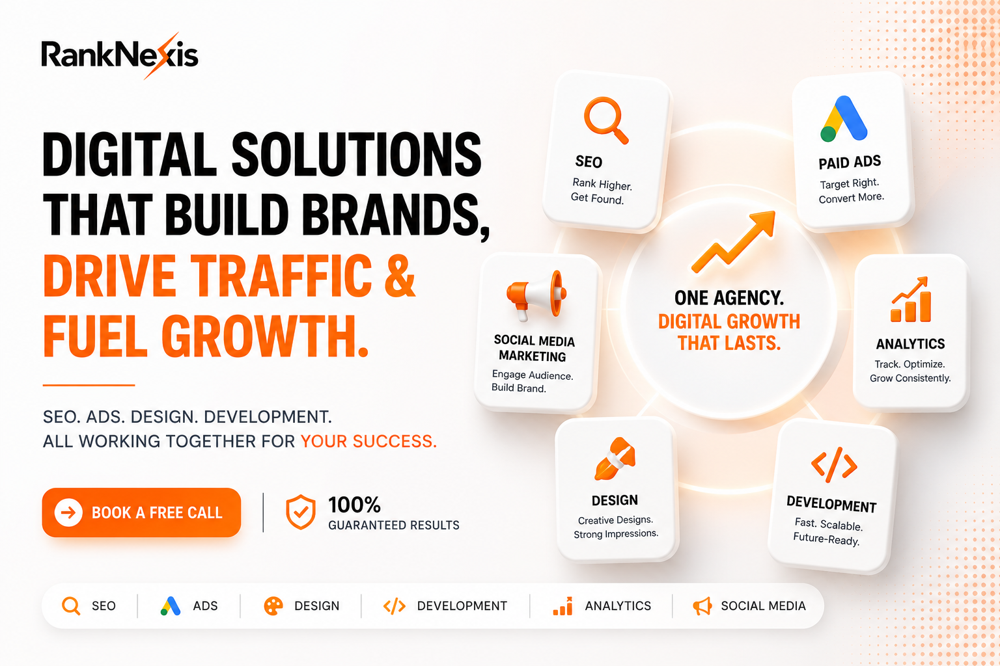

# RankNexis | Strategic Digital Operating System



RankNexis is a high-performance, agency-grade digital platform designed for strategic market positioning and service dominance. Built with a focus on speed, scalability, and premium aesthetics, it provides a unified CMS for managing complex service architectures, case studies, and enterprise-level insights.

## 🚀 Performance Philosophy

RankNexis is engineered for **60FPS fluidity** and sub-second data reactivity:
- **Zero Redundant Renders**: Component-level memoization using `React.memo`, `useCallback`, and `useMemo`.
- **Hybrid Caching**: Multi-layered strategy using React `cache()` for request deduplication and Next.js `unstable_cache()` for persistent edge delivery.
- **Visual Optimization**: Native `next/image` integration for superior Core Web Vitals and LCP performance.
- **Surgical Revalidation**: Instant path-based cache purging ensures the public site remains 100% reactive to dashboard updates.

## 🛠 Tech Stack

- **Framework**: Next.js 15+ (App Router)
- **Database**: PostgreSQL with Prisma ORM
- **Styling**: Tailwind CSS with Framer Motion animations
- **Auth**: Secure JWT-based session management with Edge-compatible Middleware(Proxy)
- **CMS**: custom premium editor with SEO-first internal linking logic
- **Infrastructure**: Lucide Icons, Sonner notifications, PWA Manifest

## ✨ Core Features

- **PWA Integration**: Installable "Digital Console" experience for mobile and desktop.
- **Dynamic Page Architecture**: Build and reorder page modules in real-time.
- **SEO Graph Engine**: Manage internal link logic, JSON-LD schema, and metadata.
- **Feedback Loop Sync**: Centralized testimonial management with global sync protocols.
- **Case Study Hub**: Data-driven portfolio management with rich text storytelling.
- **Insights Publication**: Advanced blog system with Table of Contents (TOC) and reading time analysis.
- **RBAC Governance**: Role-Based Access Control for Admins and Authors.
- **Talent Acquisition Engine**: End-to-end recruitment pipeline with job board and application tracking.
- **Inbound Lead Intelligence**: Real-time lead monitoring with CSV export for CRM integration.

## 📦 Getting Started

1. **Clone & Install**:
   ```bash
   git clone https://github.com/your-repo/ranknexis.git
   npm install
   ```

2. **Environment Configuration**:
   Create a `.env` file with:
   ```env
   DATABASE_URL="your-postgresql-url"
   NEXTAUTH_SECRET="your-secret"
   NEXT_PUBLIC_CLOUDINARY_CLOUD_NAME="your-cloud-name"
   ```

3. **Database Setup**:
   ```bash
   npx prisma db push
   ```

4. **Launch Engine**:
   ```bash
   npm run dev
   ```

- **Automated Metadata**: dynamic title/description generation with absolute canonical support.
- **JSON-LD Schema**: Integrated structured data for Organizations, Articles, and Services to enhance SERP visibility.
- **PWA Ready**: Offline-capable manifest configuration for a native-like experience.
- **Sitemap & Robots**: Dynamic, deduplicated route registry with precise crawl priorities.

## 🔐 Security & Governance

- **Proxy Protection**: Edge-runtime route guarding for administrative paths.
- **CSRF & JWT**: Secure session management with httpOnly cookie protocols.
- **Input Sanitization**: Content-safe parsing across all CMS editor modules.
- **Audit Logs**: (Roadmap) Tracking administrative actions across the system hub.

---
*Designed & Engineered for High-Agency Performance.*
